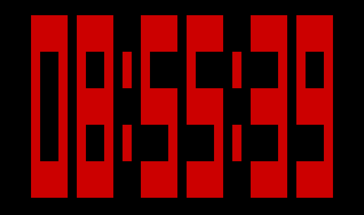

# PyClock

### What
A simple digital clock for the terminal

### Run
```
python pyclock.py
```

### Screenshot



### Controls

Keys  | Actions
----- | -------
<kbd>q</kbd> or <kbd>Q</kbd> or <kbd>Esc</kbd> | quit
<kbd>s</kbd> or <kbd>S</kbd>                   | toggle seconds
<kbd>p</kbd> or <kbd>P</kbd>                   | toggle punctuation
<kbd>c</kbd> or <kbd>C</kbd>                   | toggle center display
<kbd>a</kbd> or <kbd>A</kbd>                   | toggle auto scale display
<kbd>0</kbd> to <kbd>9</kbd>                   | change color
<kbd><</kbd> or <kbd>,</kbd>                   | decrease width
<kbd>></kbd> or <kbd>.</kbd>                   | increase width
<kbd>[</kbd> or <kbd>{</kbd>                   | decrease height
<kbd>]</kbd> or <kbd>}</kbd>                   | increase height
<kbd>-</kbd> or <kbd>_</kbd>                   | change color down
<kbd>=</kbd> or <kbd>+</kbd>                   | change color up
<kbd>`</kbd> or <kbd>~</kbd>                   | random color

### Command-line options

Options | Descriptions
------- | ------------
`-h` or `--help` | show help message
`-S` or `--no-seconds` | do not display seconds
`-s` or `--seconds` | display seconds
`-P` or `--no-punctuation` | do not display punctuation
`-p` or `--punctuation` | display punctuation
`-C` or `--no-center` | do not center clock display
`-c` or `--center` | center clock display
`-A` or `--no-auto-scale` | do not auto scale display
`-a` or `--auto-scale` | auto scale display
`-k COLOR` or `--color COLOR` | color 0-255 (default: 2)
`-f FORMAT` or `--format FORMAT` | time format (default: %I%M%S)
`-W WIDTH` or `--width WIDTH` | scale width (default: 1)
`-H HEIGHT` or `--height HEIGHT` | scale height (default: 1)

### Configuration file

Check out ```example.pyclock.conf``` for details.

### Support

- [x] Works on Linux completely

- [x] Works on OSX completely

- [ ] Windows not supported
